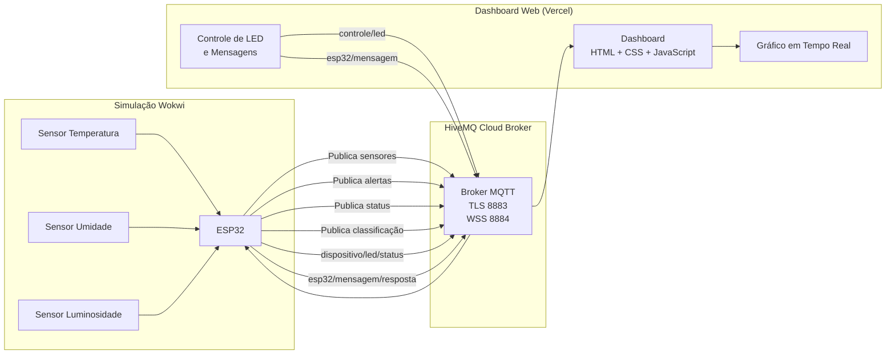

# 🌦️ Estação Meteorológica Distribuída

> Sistema de monitoramento meteorológico em tempo real via MQTT, integrando ESP32 com dashboard web.

---

## Alunos

| Nome |
|---|
| Felipe de Souza Santos |
| Luiz Gustavo Silva Bartholo |

---

## Tema

**Tema 1 — Estação Meteorológica Distribuída**

---

## Arquitetura do Sistema



### Fluxo de Funcionamento

1. Os sensores simulados no Wokwi geram valores de temperatura, umidade e luminosidade.
2. O ESP32 lê esses valores e publica no broker HiveMQ Cloud via MQTT sobre TLS (porta 8883).
3. O ESP32 classifica a temperatura em **ALTA** (≥ 32°C), **FRIA** (< 20°C) ou **NORMAL** e publica a classificação.
4. O Dashboard Web (hospedado na Vercel) conecta-se ao broker via WebSocket Seguro (porta 8884).
5. Os dados recebidos são exibidos em tempo real nos cartões e gráficos do dashboard.
6. O usuário pode enviar comandos para ligar/desligar o LED ou enviar mensagens ao ESP32.
7. O ESP32 processa os comandos e publica confirmações de volta ao dashboard.
8. O broker distribui as mensagens a todos os clientes inscritos nos tópicos correspondentes.

---

## Tópicos MQTT

| Tópico | Direção | Descrição | QoS |
|---|---|---|---|
| `clima/tupaciguara/centro/temperatura` | ESP32 → Dashboard | Temperatura em °C convertida do valor analógico | 0 |
| `clima/tupaciguara/centro/umidade` | ESP32 → Dashboard | Umidade em % convertida do valor analógico | 0 |
| `clima/tupaciguara/centro/luminosidade` | ESP32 → Dashboard | Luminosidade em % convertida do valor analógico | 0 |
| `clima/tupaciguara/centro/classificacao` | ESP32 → Dashboard | Classificação da temperatura: `ALTA`, `NORMAL` ou `FRIA` | 0 |
| `alertas/temperatura` | ESP32 → Dashboard | Alerta em JSON quando temperatura ultrapassa 32°C ou normaliza. Retain ativado | 1 |
| `status/estacao01` | ESP32 → Dashboard | Status de conexão da estação (`ONLINE` / `OFFLINE`). Retain ativado | 1 |
| `controle/led` | Dashboard → ESP32 | Comando de controle do LED (`on` / `off`) | 0 |
| `esp32/mensagem` | Dashboard → ESP32 | Mensagem de texto personalizada enviada ao ESP32 | 0 |
| `esp32/mensagem/resposta` | ESP32 → Dashboard | Confirmação de recebimento da mensagem enviada pelo dashboard | 0 |
| `dispositivo/led/status` | ESP32 → Dashboard | Feedback do estado atual do LED após execução do comando | 0 |

### Justificativa dos Níveis de QoS

**QoS 0** — utilizado para leituras de sensores e comandos de LED. Os dados são publicados a cada 5 segundos; caso uma mensagem seja perdida, uma nova leitura é enviada logo em seguida, tornando desnecessário o custo adicional de confirmação.

**QoS 1** — utilizado para `status/estacao01` e `alertas/temperatura`. Mensagens de status e alertas são críticas para o funcionamento correto da aplicação; sua perda poderia causar exibição de informações incorretas ou deixar de informar situações de risco.

---

## Classificação de Temperatura

O ESP32 processa e classifica a temperatura em tempo real com base nos seguintes critérios:

| Classificação | Condição | Cor no Dashboard |
|---|---|---|
| `ALTA` | Temperatura ≥ 32°C | 🔴 Vermelho |
| `NORMAL` | 20°C ≤ Temperatura < 32°C | 🟢 Verde |
| `FRIA` | Temperatura < 20°C | 🔵 Azul |

A classificação é publicada no tópico `clima/tupaciguara/centro/classificacao`. O alerta de temperatura alta também é publicado com retain no tópico `alertas/temperatura` em formato JSON.

---

##  Recursos MQTT Avançados

### Last Will and Testament (LWT)

O tópico `status/estacao01` utiliza LWT para informar automaticamente quando o ESP32 perde a conexão de forma inesperada. Nesse caso, o broker publica automaticamente:

```
OFFLINE
```

### Retained Messages

Os tópicos `status/estacao01` e `alertas/temperatura` utilizam mensagens Retained. Dessa forma, quando um novo cliente se conecta ao broker, ele recebe imediatamente o último estado conhecido — sem precisar aguardar uma nova publicação.

---

## Tecnologias e Bibliotecas

### Hardware / Firmware

| Tecnologia | Descrição |
|---|---|
| **ESP32** | Microcontrolador com Wi-Fi integrado |
| **Arduino (C++)** | Linguagem de programação do firmware |
| **WiFi.h** | Conexão à rede Wi-Fi no ESP32 |
| **WiFiClientSecure.h** | Conexão TLS/SSL sobre Wi-Fi |
| **PubSubClient** | Cliente MQTT para Arduino/ESP32 |
| **Wokwi** | Simulador de hardware IoT online |

### Dashboard Web

| Tecnologia | Descrição |
|---|---|
| **HTML5 / CSS3** | Estrutura e estilização da interface |
| **JavaScript (ES6+)** | Lógica de comunicação e interatividade |
| **MQTT.js** | Cliente MQTT via WebSocket para o navegador |
| **Chart.js** | Geração de gráficos em tempo real |

### Infraestrutura

| Tecnologia | Descrição |
|---|---|
| **HiveMQ Cloud** | Broker MQTT na nuvem com suporte a TLS (porta 8883) e WSS (porta 8884) |
| **Vercel** | Hospedagem do dashboard web |

---

## 🗃️ Estrutura do Projeto

```
├── firmware/
│   └── sketch.ino                  # Código do ESP32
└── dashboard_metereologia/
    ├── index.html                  # Interface web
    ├── script.js                   # Lógica MQTT e gráficos
    └── style.css                   # Estilização
```

---

## Como Executar

### Firmware (ESP32 via Wokwi)

1. Acesse o projeto no Wokwi: [https://wokwi.com/projects/465564875435529217](https://wokwi.com/projects/465564875435529217)
2. Clique em **▶** para iniciar o ESP32 simulado.
3. O ESP32 conecta automaticamente ao broker HiveMQ e começa a publicar os dados dos sensores.

### Dashboard Web

1. Acesse o dashboard hospedado: [https://estacao-metereologica-flame.vercel.app/](https://estacao-metereologica-flame.vercel.app/)
2. O dashboard conecta automaticamente ao broker HiveMQ via WebSocket seguro.
3. Os dados aparecem em tempo real nos cartões e gráficos; os controles ficam disponíveis na interface.

---

## Teste Documentado

Para validar a comunicação com o broker MQTT na nuvem, foi utilizado o cliente **Mosquitto** instalado localmente.

**Comando utilizado:**

```bash
mosquitto_sub.exe -h <broker-host> -p 8883 -u <usuario> -P <senha> -t "#" --tls-version tlsv1.2 --insecure
```

**Resultado:** o cliente Mosquitto recebeu em tempo real as mensagens publicadas pelo ESP32 e pelo Dashboard Web através do broker HiveMQ Cloud.

**Evidência:**


---

##  Links

| Recurso | Link |
|---|---|
|Dashboard Web | [https://estacao-metereologica-flame.vercel.app/](https://estacao-metereologica-flame.vercel.app/) |
|Simulador ESP32 | [wokwi.com/projects/465564875435529217](https://wokwi.com/projects/465564875435529217) |
